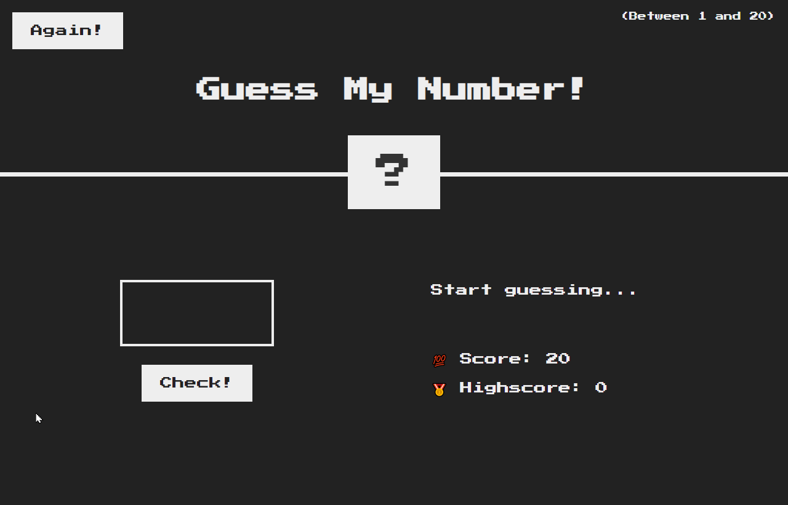

# Guess My Number

The player must guess a secret number between 1 and 20. For each wrong guess, the score is decreased by 1 and a message is displayed indicating whether the number is too high or too low. When the player reaches a score of 0 he loses the game. Clicking the "Again" button starts a new game.

